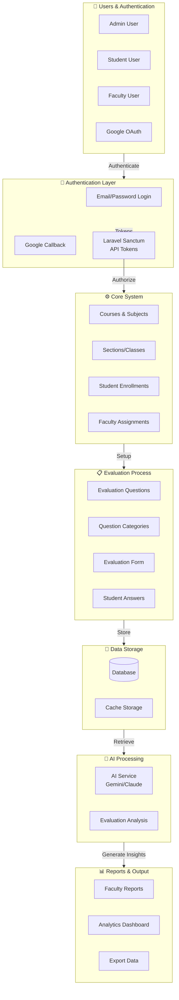
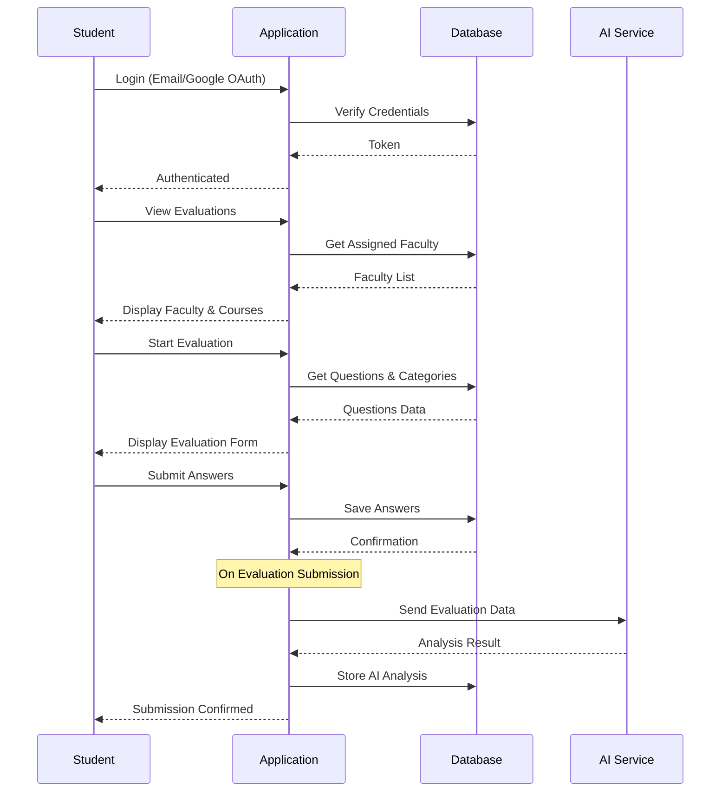
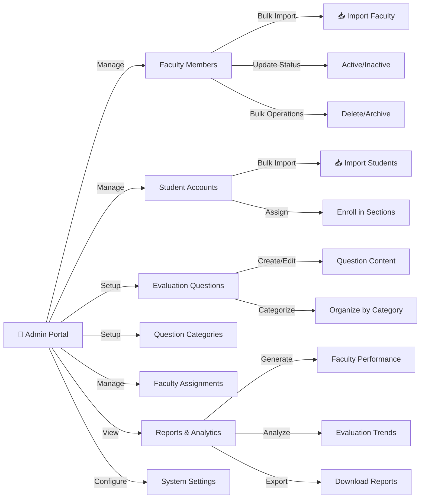
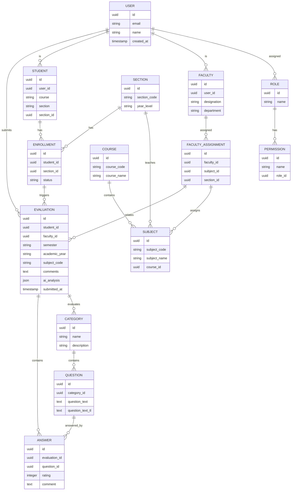
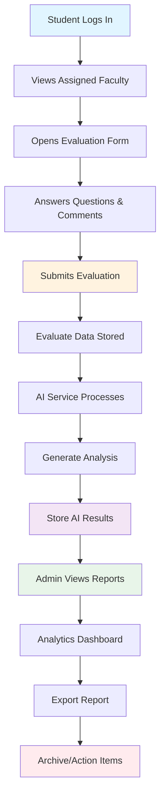

# Faculty Evaluation System - Flow Diagram

## System Overview

This is a comprehensive faculty evaluation system built with Laravel that allows students to evaluate faculty members across different courses and subjects.

---

## Main System Architecture



---

## Student Evaluation Workflow



---

## Admin Management Workflow



---

## Database Entity Relationships



---

## Key Features & Processes

### 1. **Authentication** 🔐
- Email/Password Login
- Google OAuth Integration
- Laravel Sanctum API Tokens
- Account Linking

### 2. **Faculty Management** 👨‍🏫
- Import Faculty in Bulk
- Update Faculty Status
- Assign to Subjects/Sections
- Manage Faculty Roles & Permissions

### 3. **Student Management** 👨‍🎓
- Import Student Records
- Enroll in Sections
- Track Enrollments
- Manage Student Roles

### 4. **Evaluation System** 📋
- Create Questions by Category
- Distribute Evaluations
- Collect Student Responses
- Calculate Ratings
- Store Comments

### 5. **AI Analysis** 🤖
- Process Evaluation Responses
- Generate Insights using Gemini/Claude
- Sentiment Analysis
- Performance Analytics

### 6. **Reporting** 📊
- Faculty Performance Reports
- Evaluation Statistics
- Trend Analysis
- Export Data (Excel, PDF)

---

## API Endpoints Structure

```
POST   /api/login                    → Student/Admin Login
GET    /api/auth/google              → Google OAuth Redirect
POST   /api/auth/google/register     → Google Registration
GET    /api/courses                  → Fetch Courses
GET    /api/settings                 → Get System Settings
POST   /api/settings                 → Update Settings

FACULTY MANAGEMENT
GET    /api/faculty                  → List Faculty
POST   /api/faculty                  → Create Faculty
PUT    /api/faculty/{id}             → Update Faculty
DELETE /api/faculty/{id}             → Delete Faculty
POST   /api/faculty/import           → Bulk Import

STUDENTS
GET    /api/students/all             → List All Students
POST   /api/enrollment               → Create Enrollment

EVALUATIONS
GET    /api/evaluations              → Get My Evaluations
GET    /api/evaluations/{id}         → Get Evaluation Details
POST   /api/evaluations              → Submit Evaluation
POST   /api/evaluations/assign       → Assign Evaluation

QUESTIONS
GET    /api/questions                → Get Evaluation Questions
GET    /api/categories               → Get Question Categories

REPORTS
GET    /api/reports/faculty/{id}     → Faculty Report
GET    /api/reports/analytics        → System Analytics
POST   /api/reports/export           → Export Report

PERMISSIONS & ROLES
GET    /api/roles                    → List Roles
GET    /api/permissions              → List Permissions
POST   /api/user-roles               → Assign Role to User
```

---

## Data Flow: From Evaluation to Report



---

## System Technologies

| Layer | Technology |
|-------|-----------|
| **Backend** | Laravel 11, PHP 8.3+ |
| **Frontend** | Vue.js, Vite |
| **Database** | MySQL/PostgreSQL |
| **Authentication** | Sanctum, Google OAuth |
| **AI Integration** | Google Gemini / Claude API |
| **Queue Jobs** | Notifications, Analysis |
| **File Storage** | Laravel Filesystem |
| **Caching** | Redis/File Cache |

---

## Key Business Rules

1. **Student Role**: Can only evaluate assigned faculty members
2. **Faculty Role**: Can view their own evaluations and reports
3. **Admin Role**: Full system access and management capabilities
4. **Evaluation Submission**: Must complete all required questions
5. **AI Analysis**: Triggered automatically after evaluation submission
6. **Report Generation**: Available after evaluation period closes
7. **Data Privacy**: Student anonymity maintained in faculty reports

---

## Security Features

- ✅ Role-Based Access Control (RBAC)
- ✅ Permission-Based Authorization
- ✅ API Token Authentication (Sanctum)
- ✅ CSRF Protection
- ✅ Data Encryption
- ✅ Audit Logging
- ✅ Rate Limiting

---

**Last Updated**: May 23, 2026
